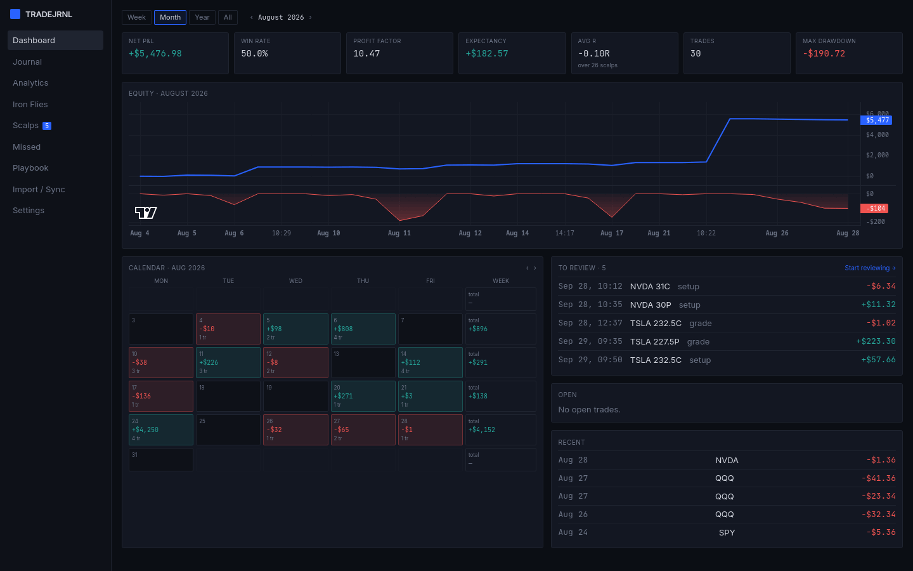
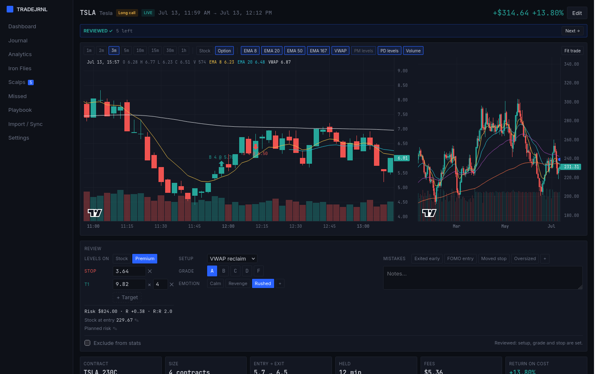
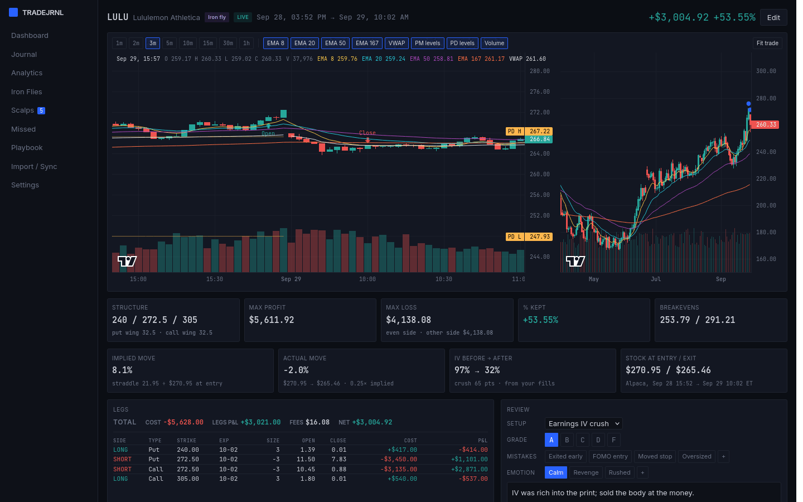
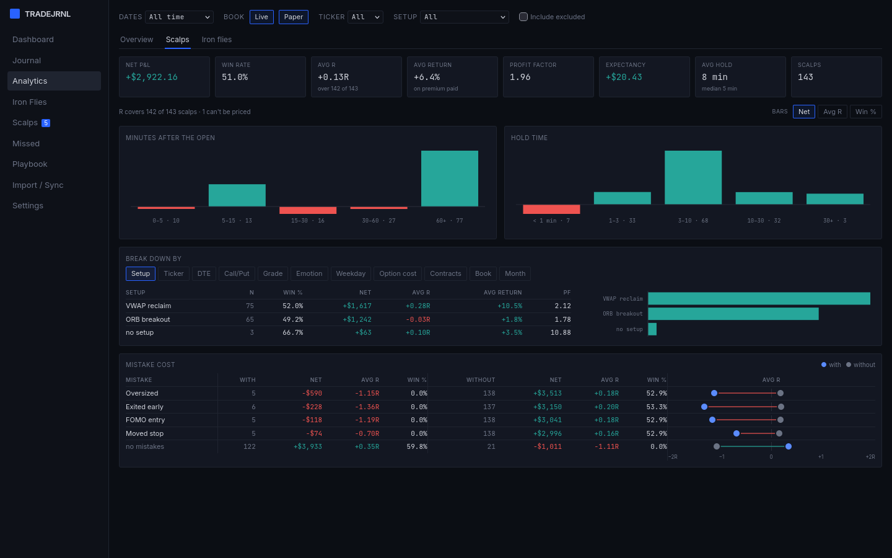
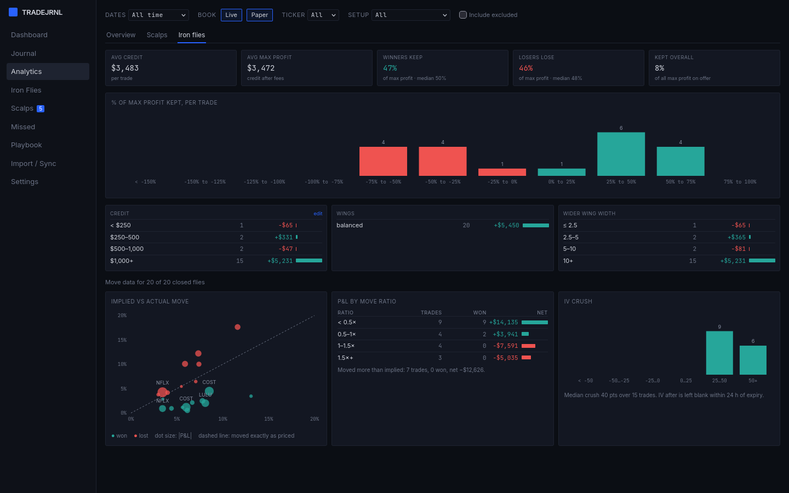
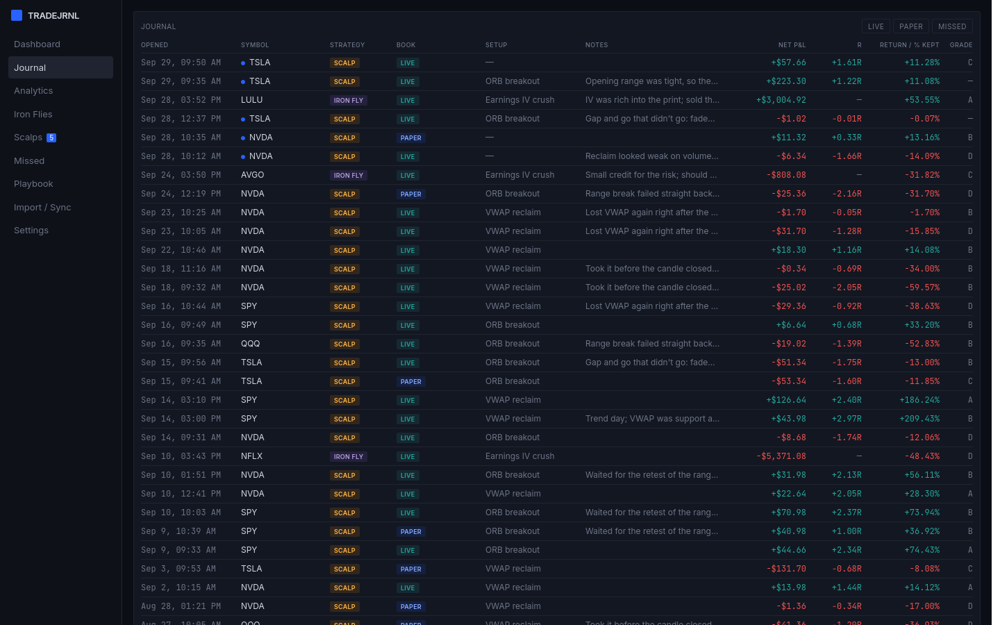
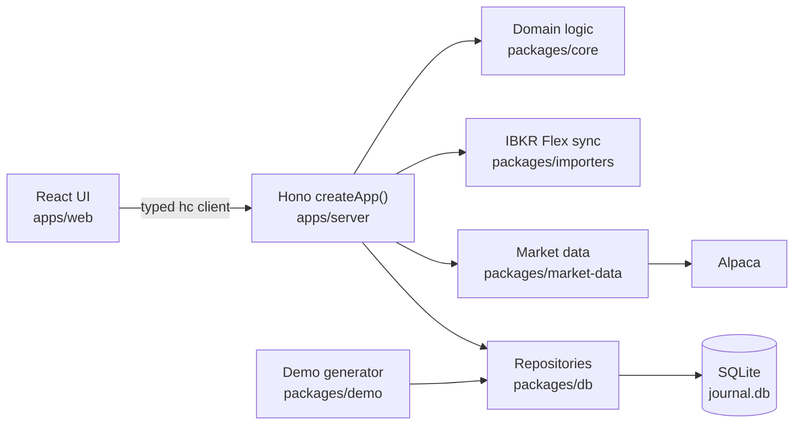

# Trading Journal

A local-first options trading journal for two very different strategies: short-dated
scalps near the market open, and earnings IV-crush iron flies.

It runs entirely on your own machine. There is no account, no server to sign up for,
and no telemetry.



## Try it with demo data

```
pnpm install
pnpm demo           # http://127.0.0.1:4179
```

`pnpm demo` builds the app, makes a fresh journal of about six months of fake scalps and
earnings iron flies, with synthetic prices so every chart draws without an API key, and
opens it on its own port. It lives in your system's temp directory (or `TJ_DEMO_DIR`),
is replaced on the next run, and never touches your own journal. `--end YYYY-MM-DD` and
`--seed N` pick the period and the data. The screenshots here are of
`pnpm demo --end 2026-09-30`, with the Dashboard stepped back to August. By default the
demo ends with yesterday's session. Nothing in it comes from a real account or real
market data.

## Your data stays yours

The repository holds code only. Your trades live in a data directory outside it:

| OS | Location |
|---|---|
| Linux | `$XDG_DATA_HOME/trading-journal` (usually `~/.local/share/trading-journal`) |
| Windows | `%APPDATA%\trading-journal` |

Set `TJ_DATA_DIR` to put it somewhere else. The directory holds `journal.db`, your
screenshots, automatic backups taken before every migration, and any API tokens you
configure. None of it is ever written into the repository.

### Live prices and option chains (optional)

With a free [Alpaca](https://alpaca.markets) paper-account key, saved on the Settings
page, the journal shows each symbol's last price, lets the builder pick expiries and
strikes from the listed chain, and estimates what closing an open trade would realise.
Estimates are shown, never stored. Without a key everything else works as before.

## Run it yourself

Requires Node 22 or newer and pnpm (`corepack enable` sets pnpm up). Then, on Linux,
macOS or Windows:

```
pnpm install
pnpm dev:server     # API on http://127.0.0.1:4178
pnpm dev:web        # UI on http://127.0.0.1:5173
```

To run it the way you'd use it day to day, with UI and API served together:

```
pnpm start          # http://127.0.0.1:4178
```

Or use the start scripts: `./scripts/start.sh` on Linux and macOS, `scripts\start.cmd` on
Windows. The server binds to loopback only and refuses requests that don't come from
`localhost`.

## What it tracks

- **Iron flies** — structure (including broken wings, where each side's risk is
  measured separately), credit and how much of it you keep, max loss, breakevens, and the
  earnings context around the trade: implied vs actual move and IV crush, worked out from
  your fills and Alpaca's historical stock prices, and settling an expired fly at intrinsic
  value. Imported from oQuants, typed in, and synced from IBKR paper, as one trade however
  many orders its legs took.
- **Scalps** — synced from IBKR (Flex Web Service) from a start date you choose, or
  typed in, with every fill kept; reviewed on the trade page with the chart: drag the stop
  and targets on the stock's chart or, switched to Option, on the contract's own 1-minute
  candles with your fills at their prices; pick a setup, mistakes, an
  emotion and a grade, and work through a To review queue; setups and tags live on the
  Playbook page, with a stat card per setup. Each scalp gets its R: the stop repriced by
  Black-Scholes into dollars at risk, several targets with trims, R, R:R, MAE/MFE, its
  return on the premium paid, and Avg R on the Dashboard (MAE/MFE from the option's own
  range when the levels are on premium). The chart of the session:
  3-minute candles (1m to 1h), with a daily chart beside it, your fills marked, EMAs,
  VWAP, and premarket and prior-day levels, from Alpaca's free data.
- **Review** — a Dashboard for the current period (KPIs, equity curve with drawdown,
  P&L calendar, open and recent trades) and an Analytics page with every split at once,
  a Scalps tab (time of day, hold time, breakdowns in R and return on cost, and what each
  mistake costs), and an Iron flies tab measured against max profit.
- **Missed trades** — setups you saw but didn't take, scored in R, kept out of the
  dollar statistics.
- **Screenshots** — on every trade: paste (Ctrl+V), drop or pick PNG, JPEG or WebP images,
  with captions and a lightbox; stored once each, by content, in the data directory.
- **Two machines** — Settings → Data exports the journal as one `.tjbundle` file (a tar
  archive any tar tool can open), and merges one from your other machine: the later
  edit of a trade wins, deletes travel, IBKR fills and screenshots are combined, and
  merging the same file twice changes nothing.

<table>
  <tr>
    <td></td>
    <td></td>
  </tr>
  <tr>
    <td></td>
    <td></td>
  </tr>
</table>



*All screenshots are of `pnpm demo`'s fake data.*

Missed trades arrive in a later step; see
[the design spec](docs/superpowers/specs/2026-09-22-trading-journal-design.md) and
[the plans](docs/superpowers/plans/).

## Architecture



A pnpm monorepo in TypeScript throughout. `packages/core` holds the pure domain logic:
P&L, iron-fly structure, R by Black-Scholes, the market calendar, statistics.
`packages/db` keeps everything in one SQLite file through Drizzle, with migrations,
backups and the export/merge bundle. The server is a single `createApp()` that takes its
database, market data and broker client as arguments. The real app passes the real ones,
the tests pass in-memory or fake ones, and `pnpm demo` passes a journal filled by
`packages/demo`. The UI calls it through Hono's typed client, so a route's types reach
the React code unchanged.

## Known limitations

- **R prices the stop with Black-Scholes**: European options, no dividends, the IV solved
  at entry and the stock jumping straight to the stop. For 0DTE, time decay makes the real
  loss at the stop somewhat larger.
- **Alpaca's free data runs 15 minutes behind**, so a scalp's stock prices and today's
  chart fill in 16 minutes after the fact. Index symbols such as SPX have no bars.
- **Option bars** come from Alpaca's free plan: regular hours only, from Jan 18, 2024, and
  sparse on thin strikes. Today's run 16 minutes behind after hours, and possibly up to 80
  during the session, when Alpaca refuses the shorter delay.
- **Merging goes by each machine's clock**: the later edit wins, so keep both clocks set
  right. A synced trade takes the winning side's numbers until the next IBKR sync
  regroups its fills.
- **Charts use raw prices**, not split-adjusted ones, to match your fills. A split inside
  the daily chart's three years steps its candles, and bends the daily EMAs for months.

## Development

```
pnpm test           # vitest, all packages
pnpm typecheck      # tsc --build
pnpm lint           # biome
pnpm format         # biome, writing fixes
```

CI runs the tests, the type check and the lint on Ubuntu and Windows. See
[CONTRIBUTING.md](CONTRIBUTING.md) for how changes are made.

## Licence

MIT
